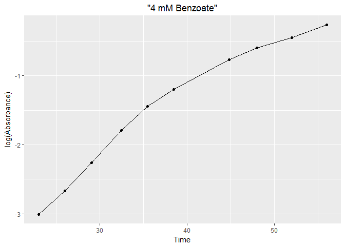

Rsquared\_Vignette
================
Michelle Chua
2017-04-21

Rsquared Info
-------------

The Rsquared package calculates the mean of replicate values (e.g. absorbance), graphs time versus the absorbance mean in log scale, and returns to users the slope of the graph, the R-squared value, and other coefficient values.

Rsquared Requirements
---------------------

1.  To use the Rsquared package, vectors must be numeric.
2.  The data should be stored as a data frame.
3.  The Rsquared package calculates means by rows via the rowMeans() function.

Example using the benzvandata data frame
----------------------------------------

The benzvandata data frame includes a column with the time in hours (object x). The df also has the absorbances (object y) of Sagitulla stellata E-37 under different growth conditions. Rsquared() will calculate the mean of each row for the rows and columns chosen by the user, ideally exponential phase. The x and y labels can be changed to any name chosen by the user (in this example: object xname = Time(Hours), object yname = log(Absorbance)). Lastly, users can also change the title (object title = 4 mM Benzoate or 2 mM Benzoate + 2 mM Vanillate).

As the figures below demonstrate, Rsquared returns a graph of time versus absorbance means on a log scale and the slope of the graph, the R-squared value, and other coefficient values. The slope can be calculated for any growth curve, and these slopes can be used to compare growth rates of different growth curves. As the slopes in the output display below, the slope of E-37 grown on 4 mM Benzoate is 0.08333, while the slope of pig replicates 4-6 is 0.137842. Therefore, one could (notwithstanding the lack of statistical analysis) say that WT E-37, on average, grew slower on 4 mM Benzoate than 2 mM Benzoate + 2 mM Vanillate.

``` r
df <- read.csv('benzvandata.csv')
Rsquared(df[c(2:11), c(2)], df[c(2:11), c(3:5)], Time, log(Absorbance), '4 mM Benzoate')
```



    ## 
    ## Call:
    ## stats::lm(formula = num ~ x)
    ## 
    ## Residuals:
    ##     Min      1Q  Median      3Q     Max 
    ## -0.2732 -0.1661  0.0163  0.1551  0.2564 
    ## 
    ## Coefficients:
    ##              Estimate Std. Error t value Pr(>|t|)    
    ## (Intercept) -4.655991   0.255663  -18.21 8.50e-08 ***
    ## x            0.083338   0.006391   13.04 1.14e-06 ***
    ## ---
    ## Signif. codes:  0 '***' 0.001 '**' 0.01 '*' 0.05 '.' 0.1 ' ' 1
    ## 
    ## Residual standard error: 0.2166 on 8 degrees of freedom
    ## Multiple R-squared:  0.9551, Adjusted R-squared:  0.9495 
    ## F-statistic:   170 on 1 and 8 DF,  p-value: 1.135e-06

``` r
Rsquared(df[c(2:8), c(2)], df[c(2:8), c(6:8)], Time, log(Absorbance), '2 mM Benzoate + 2 mM Vanillate')
```


    ## 
    ## Call:
    ## stats::lm(formula = num ~ x)
    ## 
    ## Residuals:
    ##        1        2        3        4        5        6        7 
    ##  0.03585 -0.01282 -0.08012 -0.08471  0.08322  0.15608 -0.09751 
    ## 
    ## Coefficients:
    ##              Estimate Std. Error t value Pr(>|t|)    
    ## (Intercept) -6.314738   0.191832  -32.92 4.86e-07 ***
    ## x            0.137842   0.005725   24.08 2.30e-06 ***
    ## ---
    ## Signif. codes:  0 '***' 0.001 '**' 0.01 '*' 0.05 '.' 0.1 ' ' 1
    ## 
    ## Residual standard error: 0.1057 on 5 degrees of freedom
    ## Multiple R-squared:  0.9914, Adjusted R-squared:  0.9897 
    ## F-statistic: 579.7 on 1 and 5 DF,  p-value: 2.303e-06

Example using the dietox data frame
-----------------------------------

Another example on how to use Rsquared package and its output are detailed below. While the Rsquared package was designed for absorbance values, other values can be used. Therefore, the dietox data frame was loaded to demonstrate the capability of the Rsquared package. This data frame is provided with the the geepack package.

The dietox data frame includes a column with the time (object x). The df also has several pigs, the weights (object y) of which were taken over time. Again, the x and y labels can be changed to any name chosen by the user (in this example: object xname = Time, object yname = log(Weight)). In this example, object title = Reps 1-3 or Reps 4-6.

Similar to above, Rsquared returned a graph of time versus weight means on a log scale and the slope of the graph, the R-squared value, and other coefficient values. As the slopes in the output display below, the slope of pig replicates 1-3 is 0.123742, while the slope of pig replicates 4-6 is 0.121018. Therefore, it appears that pig reps 1-3, on average, gained weight faster than pig reps 4-6.

``` r
Rsquared(df[c(1:14), c(1)], df[c(1:14), c(2:4)], Time, log(Weight), 'Reps 1-3')
```


    ## 
    ## Call:
    ## stats::lm(formula = num ~ x)
    ## 
    ## Residuals:
    ##      Min       1Q   Median       3Q      Max 
    ## -0.11462 -0.04516  0.01714  0.04225  0.07554 
    ## 
    ## Coefficients:
    ##             Estimate Std. Error t value Pr(>|t|)    
    ## (Intercept) 3.249265   0.040740   79.76 2.35e-15 ***
    ## x           0.123742   0.005535   22.36 7.21e-10 ***
    ## ---
    ## Signif. codes:  0 '***' 0.001 '**' 0.01 '*' 0.05 '.' 0.1 ' ' 1
    ## 
    ## Residual standard error: 0.06619 on 10 degrees of freedom
    ##   (2 observations deleted due to missingness)
    ## Multiple R-squared:  0.9804, Adjusted R-squared:  0.9784 
    ## F-statistic: 499.7 on 1 and 10 DF,  p-value: 7.211e-10

``` r
Rsquared(df[c(1:14), c(1)], df[c(1:14), c(5:7)], Time, log(Weight), 'Reps 4-6')
```


    ## 
    ## Call:
    ## stats::lm(formula = num ~ x)
    ## 
    ## Residuals:
    ##      Min       1Q   Median       3Q      Max 
    ## -0.09866 -0.05263  0.02276  0.04947  0.06317 
    ## 
    ## Coefficients:
    ##             Estimate Std. Error t value Pr(>|t|)    
    ## (Intercept) 3.328713   0.038921   85.53 1.17e-15 ***
    ## x           0.121018   0.005288   22.88 5.73e-10 ***
    ## ---
    ## Signif. codes:  0 '***' 0.001 '**' 0.01 '*' 0.05 '.' 0.1 ' ' 1
    ## 
    ## Residual standard error: 0.06324 on 10 degrees of freedom
    ##   (2 observations deleted due to missingness)
    ## Multiple R-squared:  0.9813, Adjusted R-squared:  0.9794 
    ## F-statistic: 523.7 on 1 and 10 DF,  p-value: 5.729e-10
